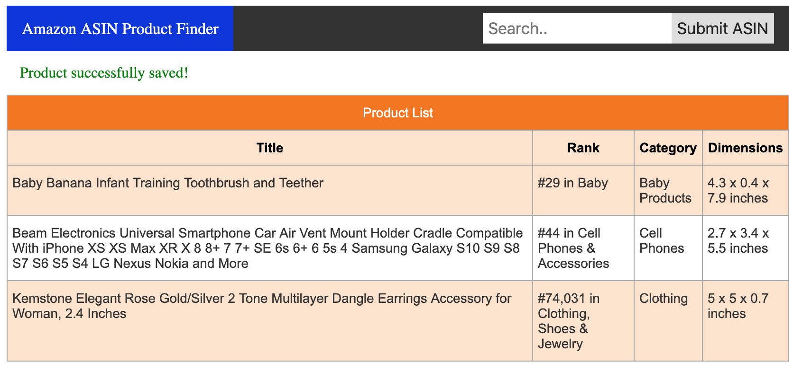

# Amazon ASIN Lookup Application

## Overview
A full-stack application that scrapes Amazon pages using their ASIN number, saves relevant information to a database and displays the information in a table.

## To Run Locally
1. Ensure you have ruby 2.5.0 installed on your machine and postgresql
2. Ensure you have chromedriver installed locally (if you are using brew, use the command `brew cask install chromedriver`)
3. Clone this repo to your machine
4. run `bundle install` via command line
5. run `rails s` via command line
6. visit `http://localhost:3000/products`

## To Run Tests
* Run `rspec` on the command line

## Development Considerations
* Utilizes Waitr gem to overcome the delayed loading amazon page
* Nokogiri is used for parsing page contents
* Custom service implemented for scraping exact nodes for Nokogiri using xpath and css lookups

## Testing Considerations
* Uses VCR to record and real http responses. This is useful for ensuring that the application appropriately handles a variety of page layouts and that all parsing is working as it should.

## Screenshot

